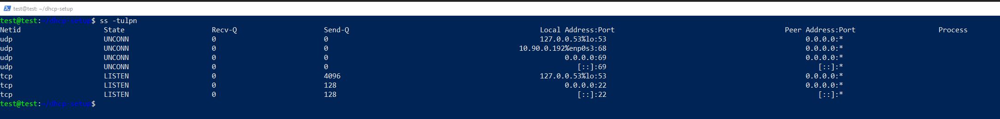

# Ubuntu-DHCP-iPXE
 Bundle for DHCP, TFTP, PXE and iPXE


## quick & dirty install (ubuntu)
last tested on a **fresh** ubuntu 20.04

**network is 10.90.0.0/24** - *if you want to change this, fork this repo and check the customize folder*

```bash
sudo apt install git -y && git clone https://github.com/oje-edu/Ubuntu-DHCP-iPXE.git dhcp-setup && cd dhcp-setup && sudo bash install.sh
```





## NOTE:
the inside bash "script" is very low level (so everybody can understood it without having a PHD) - I know there my be some "better" solutions (ansible, netboot.xyz etc) for doing this. 


### forked from psychopomposwow
YEAH surprise ... its one of my old account's
